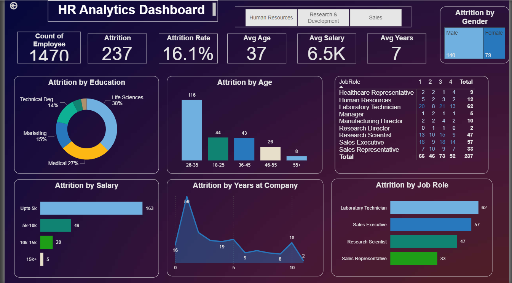

# 👨‍💼 HR Analytics Dashboard  

## 📌 Project Overview  
This project presents an **HR Analytics Dashboard** built in **Power BI** to analyze employee attrition and workforce demographics.  

The dashboard helps HR teams and management understand **why employees leave**, identify **attrition trends by demographics**, and support **data-driven retention strategies**.  

---

## 🚀 Features & Insights  

### 🔹 Key KPIs  
- **Total Employees** → 1470  
- **Attrition Count** → 237  
- **Attrition Rate** → 16.1%  
- **Average Age** → 37 years  
- **Average Salary** → 6.5K  
- **Average Tenure** → 7 years  

### 📊 Visual Insights  
- **Attrition by Education** → Life Sciences (38%) had the highest attrition, followed by Medical (27%).  
- **Attrition by Age** → Employees aged **26–35** and **18–25** showed the highest attrition levels.  
- **Attrition by Job Role** → Highest attrition among Laboratory Technicians (62), Sales Executives (57), and Research Scientists (47).  
- **Attrition by Salary** → Majority of attrition occurred in employees earning **up to 5K**.  
- **Attrition by Gender** → Male attrition (140) was higher than Female (79).  
- **Attrition by Department** → Research & Development and Sales had higher exits compared to HR.  
- **Attrition by Years at Company** → Most attrition occurred in the **first 1–5 years of employment**.  

📌 **Dashboard Preview**  
  

---

## 🛠️ Tools & Technologies  
- **Power BI Desktop** → Data visualization & reporting  
- **Power Query** → Data cleaning & shaping  
- **DAX** → Custom measures for KPIs  

---

