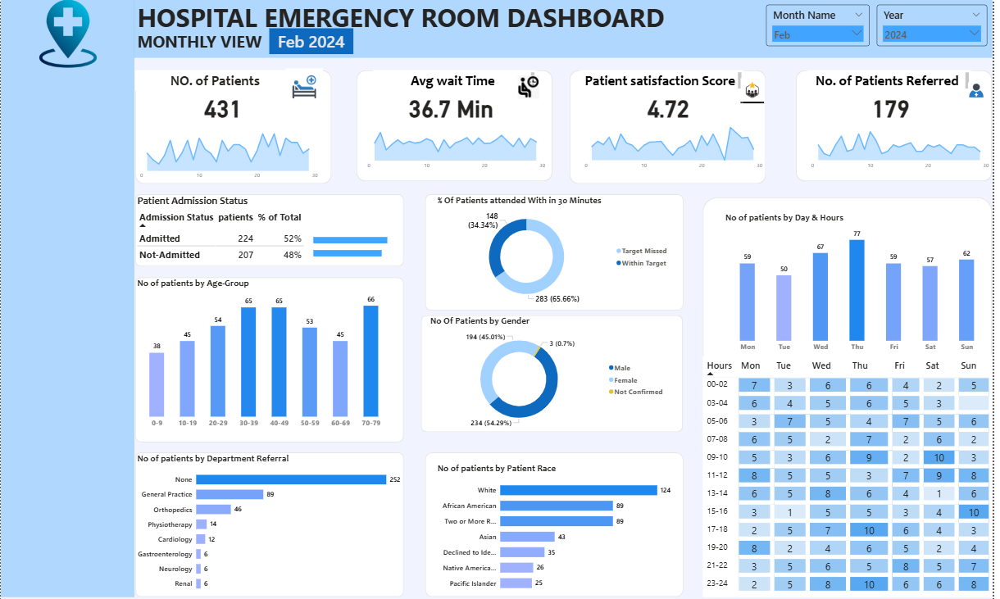
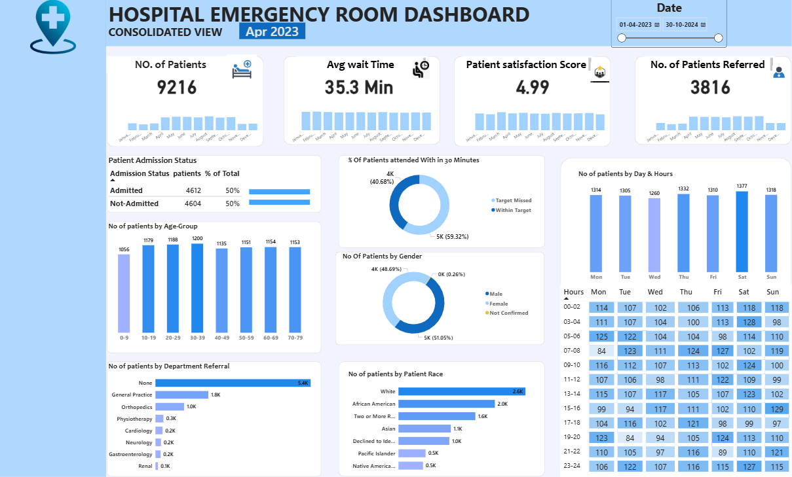
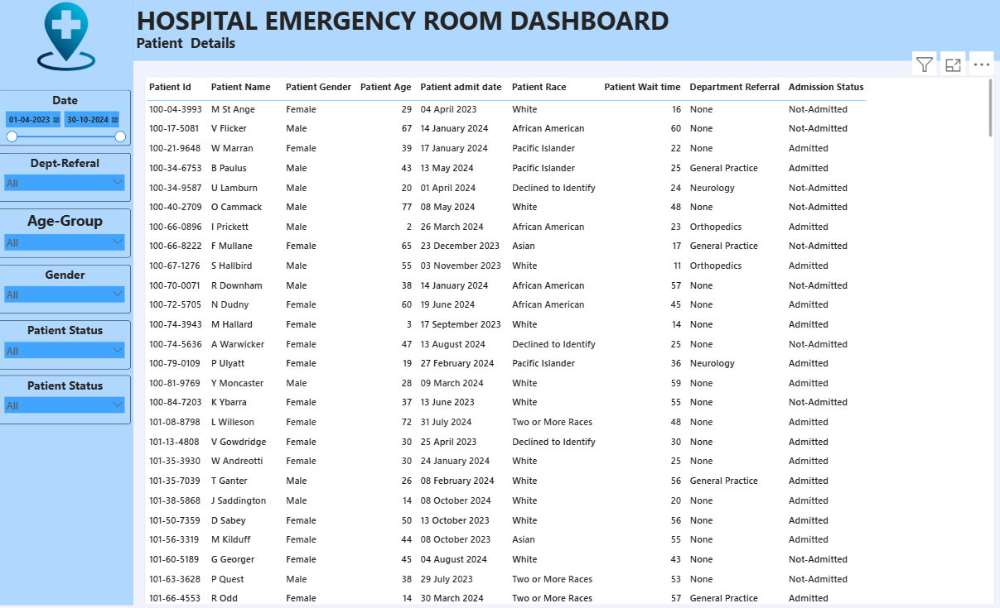
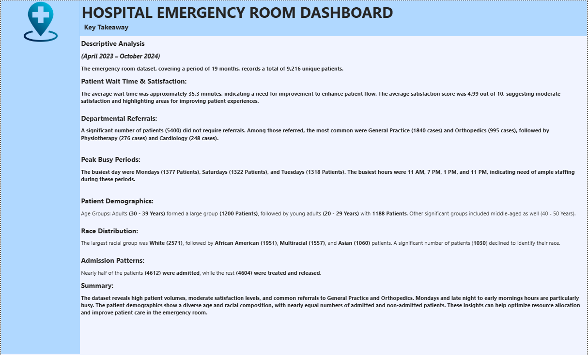

# 🏥 Hospital Emergency Room Dashboard  

## 📌 Project Overview  
This project presents a **Power BI dashboard** built to analyze hospital **emergency room performance** across admissions, demographics, wait times, referrals, and patient satisfaction.  

The dataset covers **9,216 unique patients (Apr 2023 – Oct 2024)** and provides insights for **hospital management and resource optimization**.  

---

## 🚀 Features & Insights  

### 🔹 Key KPIs  
- **Total Patients** → 9,216  
- **Admission Rate** → 50% (4,612 Admitted, 4,604 Not Admitted)  
- **Average Wait Time** → 35.3 minutes  
- **Average Patient Satisfaction** → 4.99 / 10  

### 📊 Visual Insights  
- **Patient Demographics**  
  - Age: Highest in **30–39 (1200)** and **20–29 (1188)** age groups  
  - Gender: **Male 51%**, Female 49%  
  - Race: White (2,571), African American (1,951), Multiracial (1,557), Asian (1,060), others  

- **Admission Patterns**  
  - Equal split between admitted & non-admitted patients (≈50% each)  
  - Major referrals: **General Practice (1,840)**, **Orthopedics (995)**, **Physiotherapy (276)**, **Cardiology (248)**  

- **Patient Wait Time & Satisfaction**  
  - Avg wait time: ~35 mins  
  - Only **59.3% patients were attended within 30 minutes** (target improvement area)  
  - Satisfaction moderate (avg 4.99/10)  

- **Peak Workload Trends**  
  - **Busiest Days**: Monday (1377), Saturday (1322), Tuesday (1318)  
  - **Busiest Hours**: 11 AM, 1 PM, 7 PM, 11 PM → staffing bottlenecks identified  

📌 **Dashboard Preview**  

---

## 🛠️ Tools & Technologies  
- **Power BI Desktop** → Data modeling & visualization  
- **Power Query** → Data cleaning & shaping  
- **DAX** → Custom KPIs (Wait Time, Admission %, Satisfaction)  

---

 
