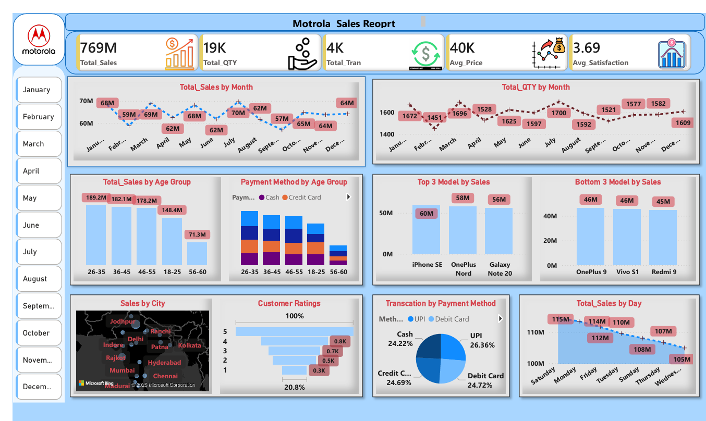

# 📊 Motorola Sales Dashboard  

## 📌 Project Overview  
This project presents a **Power BI dashboard** analyzing Motorola’s sales performance across **time, products, payment methods, and customer demographics**.  

The report provides a **360° view of sales trends, customer satisfaction, and purchasing behavior**, enabling data-driven business insights.  

---

## 🚀 Features & Insights  

### 🔹 Key KPIs  
- **Total Sales** → 769M  
- **Total Quantity Sold** → 19K  
- **Total Transactions** → 4K  
- **Average Price** → 40K  
- **Average Customer Satisfaction** → 3.69 / 5  

### 📊 Visual Insights  
- **Sales Trends** → Monthly sales ranged between 57M–70M with consistent seasonality.  
- **Quantity by Month** → Steady demand across months, peak at 1,700+ units.  
- **Top 3 Models by Sales** →  
  - iPhone SE (60M)  
  - OnePlus Nord (58M)  
  - Galaxy Note 20 (56M)  
- **Bottom 3 Models by Sales** →  
  - OnePlus 9 (46M)  
  - Vivo S1 (45M)  
  - Redmi 9 (46M)  
- **Payment Method Share** → UPI (26.36%) was the most used, followed by Debit & Credit Cards (~24% each).  
- **Customer Ratings** → Majority gave **4–5 star ratings**; very few gave 1–2 stars.  
- **Sales by Day** → Peak sales on **Saturday (115M)**, lowest on **Monday (105M)**.  
- **Sales by Age Group** →  
  - 26–35 → 189.2M  
  - 36–45 → 182.1M  
  - 46–55 → 178.2M  
  - 18–25 → 148.4M  
  - 56–60 → 71.3M  
- **Sales by City** → Strongest sales in **Delhi, Mumbai, Chennai, Hyderabad, Kolkata**.  

📌 **Dashboard Preview**  
  

---

## 🛠️ Tools & Technologies  
- **Power BI Desktop** → Data modeling & visualization  
- **Power Query** → Data preparation & transformations  
- **DAX** → Custom KPIs & measures  

---

